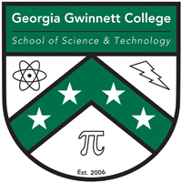

# InternApp - Team Meraki

**Repo Location URL:** [Fall 2019 InternApp Repo](https://github.com/soft-eng-practicum/internapp/tree/fall2019)

**Progress Tracking Tool URL:** [Jira](https://jira.ggc.edu/secure/RapidBoard.jspa?rapidView=34&projectKey=MIC)

**Communication Tool:** Discord #meraki-sd2-cg

# InternApp - Tech Titans

**Repository Location URL:** [Github Repository InternshipApp](https://github.com/soft-eng-practicum/internapp/tree/fall2018)

**Process Tool and URL:** [Jira](http://itec-gunay.duckdns.org:8080/)

**Communication Tool:** [#TechTitans Discord](https://discordapp.com/channels/349336806208045068/484669720797118479)

**Live Application Link:** [InternApp](http://ggc-internapp.herokuapp.com/)

## License

**Attribution-ShareAlike 4.0 International (CC BY-SA 4.0):** [Legal implications](https://creativecommons.org/licenses/by-sa/4.0/legalcode)

**Signed Fall 2019 Intellectual Ownership Agreement:** [Google drive link](https://dochub.com/jcantillo333/3jwyjBJ/internapp-fall-2019-intellectual-property-agreement-pdf?dt=kCxAT_qCa2ezmwysfbsw)

## Overview

_Internapp is a web application designed to centralize the application process for the Information Technology (ITEC 4900) and Biology (BIOL 4800) internship programs for both student and coordinator. The application will allow for students to apply to the ITEC and BIOL internship programs and for the internship program coordinators to view, download, and archive the applications. The coordinators will be able to provide feedback and update the status of a student's application, which the student will be able to view. Information pertaining to possible/current internship job sites will also be stored._

## Final Reports

**Fall 2019 Final Report:** [Google docs link](https://docs.google.com/document/d/1MQaREmzLE_9U59A04JfEccMAPuCan4-f5sTt4SA3dzQ/edit?usp=sharing)

**Fall 2018 Final Report:** [Google docs link](https://docs.google.com/document/d/14bPVeReTpH6RkloFUZmiIxMZo8cSe6K3K5anvwolyLU/edit?usp=sharing)

## CREATE Surveys and Results

**Fall 2019 Survey:** [Surveymonkey Link](https://www.surveymonkey.com/r/QTLBVFX)

**Fall 2019 Survey Results:** [Google docs link](https://drive.google.com/file/d/1WRkBi8bfRJdgSYi_C74Fzfi8E_3_JBC3/view)

**Fall 2018 Survey:** [Surveymonkey Link](https://www.surveymonkey.com/r/PDBYFQT)

**Fall 2018 Survey Results:** [Google docs link](https://drive.google.com/open?id=1g0W9waGUavpq-RcSLb5mhasSQGrxeIgh)

## Application Videos

**Fall 2019 Final demo video:** [Google docs link](https://www.youtube.com/watch?v=CB7A34H65l4)

**Admin / Instructor & User (Student) help videos:** [Google docs link](https://drive.google.com/open?id=1cq0CpIgEMnVpqNSvyIA5uAYXXzTBwhPd)

## Clientele

- Information Technology Internship Program Coordinator - [Dr. Lissa Pollacia](http://www.ggc.edu/about-ggc/directory/lissa-pollacia)
- Biology Internship Program Coordinator - [Dr. Latanya P. Hammonds-Odie](http://www.ggc.edu/about-ggc/directory/latanya-hammonds-odie)

## Internship Program Information

- [Information Technology Internship Program](http://www.ggc.edu/academics/schools/school-of-science-and-technology/internships/#itec4900)
- [Biology Internship Program](http://www.ggc.edu/academics/schools/school-of-science-and-technology/internships/#biol4800)

## Fall 2021 Team Members
1. _Michael Murillo - [@murillomichael](https://github.com/murillomichael):_ **_Team Manager_** &
**_UI/UX design_** & **_Programmer_** 💰 💰   
2. _Matthew Rosario - [@mrosario123](https://github.com/mrosario123):_ **_Data Modeler_** & 
**_Documentation Lead_** & **_Programmer_** 🏦  
3._Jordan - [@](https://github.com/):_ **_Code architecture/lead programmer_** &
**_Testing lead_** & **_Programmer_** 💰 💰   

## Fall 2019 Team Members
1. _Ethan Kim - [@ekim22](https://github.com/ekim22):_ **_Team lead_** &
**_Client Liaison_** :smiley:  
2. _Kyle Tate - [@kyletate](https://github.com/kyletate):_ **_UI/UX_** &
**_Programmer_** :tophat:  
3. _Jordan Vincent - [@jordatvincent](https://github.com/jordantvincent):_ **_UI/UX_** & **_Data Modeler_** :moneybag:  
4. _Leon Le - [@weaponized](https://github.com/weaponized):_ **_Testing Lead_** & **_Programmer_** :spider:  
5. _Jose Cantillo - [@jcantillo](https://github.com/jcantillo94):_ **_Programming Lead_** & **_Documentation Lead_** :shipit:  

## Fall 2018 Team Members

1. _Kidus Dawit - [@kidus13](https://github.com/kidus13):_ **_QA_** & **_Team Lead_**  
2. _Anastasia Arnold_ - [@aarnold7](https://github.com/aarnold7): **_Code Architecture/Lead Programmer_** & **_UI/UX Design_** 
3. _Billy Pridgen_ - [@WilliamPridgen](https://github.com/WilliamPridgen): **_Data Modeler_** & **_Client Liaison_**  
4. _Edgar Juarez_ - [@ejuarezcabrera](https://github.com/ejuarezcabrera): **_Documentation Lead_** & **_Programmer_**  

## Spring 2017 Team Members

1. _Blake Norman_ - [@bnorman37](https://github.com/blakenorman37): **_Project Manager_** & **_Testing Lead_** 
2. _Michael Cawthon_ - [@mcawthon](https://github.com/mcawthon): **_Data Modeler_** & **_Programmer_** 
3. _Robert Bryan_ - [@rbryan21](https://github.com/rbryan21): **_Lead Programmer_** & **_Documentation Lead_** 
4. _Khaled Asad_ - [@khaledasad](https://github.com/khaledasad): **_UI/UX Design_** & **_Testing_** 

## Fall 2016 Team Members

1. _Vimal Darji :_ **_QA_** & **_Team Lead_**  
2. _Taylor Brust :_ **_Client Liason_**  
3. _Joseph Cox :_ **_Lead programmer_** & **_Data modeler_** 
4. _Jonathan Nguyen :_ **_UI/UX Design_** & **_Documentation lead_** 

## Running the application on your local machine

1. **[Install Node.js (either version is fine)](https://nodejs.org/en/)** 

   &nbsp;&nbsp;&nbsp;&nbsp;a. To ensure you have Node.js installed, run 'node --version' within your terminal/command line 

2. **[Clone this github repository to your local machine](https://github.com/soft-eng-practicum/internapp)** 
3. **Navigate to the internapp folder in your terminal/command line** 
4. **Run the command 'npm install'** 
5. **Run the command 'npm start'** 
6. **Navigate to localhost:8000/ within your browser** 
